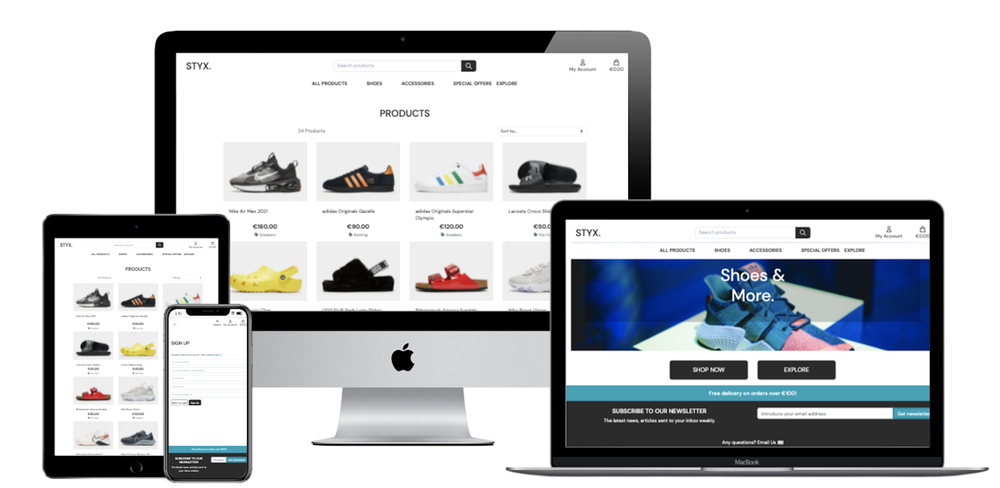
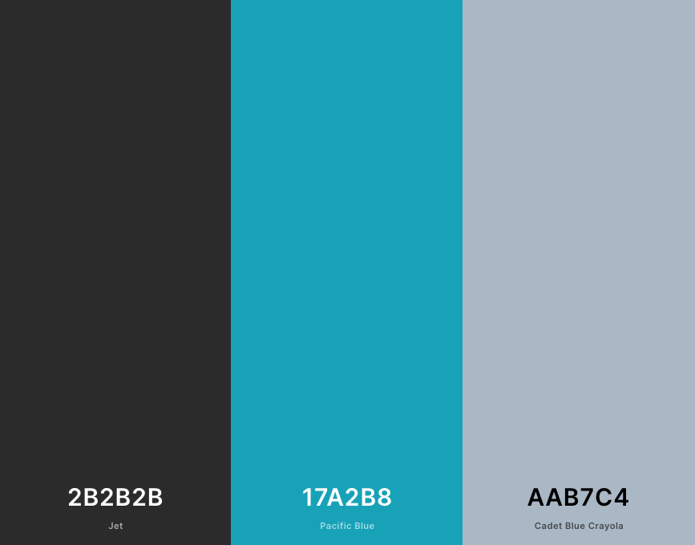
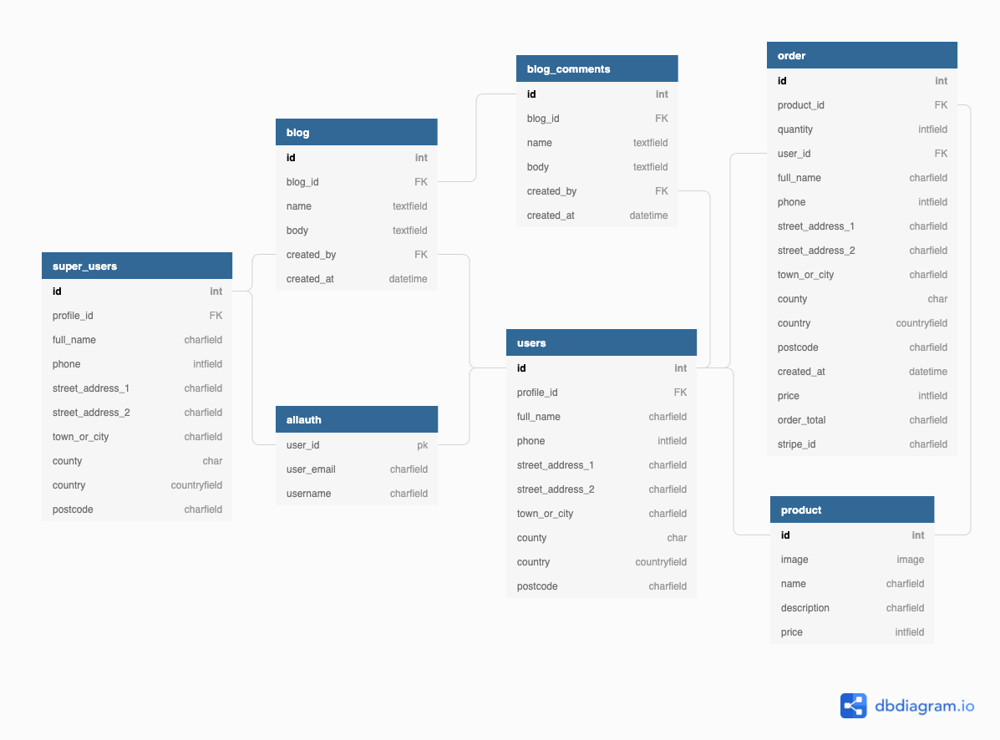

<h1> Styx Shoes </h1>

View a live version of the site [here](https://styx-shoes.herokuapp.com/).

This project has been created for educational purposes.

It is an E-Commerce site for a fictional company 'Gamer Supplies' which offers a variety of snacks for sale.


___

## Table of Contents

- [Database Schema](#database-schema)
- [Features](#features)
  - [Existing Features](#existing-features)
    - [Features in all apps](#features-in-all-apps)
    - [Features on the Home Page](#features-on-the-home-page)
    - [Features on the Sign Up Page](#features-on-the-sign-up-page)
    - [Features on the Sign In/Log in Page](#features-on-the-sign-inlog-in-page)
    - [Features on All Products](#features-on-all-products)
    - [Features on the Products Information Page](#features-on-the-products-information-page)
    - [Features on the Explore Page](#features-on-the-explore-page)
    - [Features on the Post Page](#features-on-the-post-page)
    - [Features on the Profile Page](#features-on-the-profile-page)
    - [Features on the Product Management - Add and Edit a Product](#features-on-the-product-management---add-and-edit-a-product)
    - [Features on the Shopping Bag](#features-on-the-shopping-bag)
    - [Features on the Checkout Page](#features-on-the-checkout-page)
    - [Features on the Confirmation/Thank you Page](#features-on-the-confirmationthank-you-page)
    - [Features on the Subscription feature](#features-on-the-subscription-feature)
    - [Custom error pages](#custom-error-pages)
  - [Future features](#future-features)
- [Technologies Used](#technologies-used)
  - [Backend:](#backend)
  - [Programming Languages](#programming-languages)
  - [Libraries](#libraries)
  - [API's](#apis)
  - [Email](#email)
  - [Database](#database)
  - [Tools](#tools)
- [Testing](#testing)
- [Deployment](#deployment)
  - [Local Deployment](#local-deployment)
  - [Heroku Deployment](#heroku-deployment)
- [Credits](#credits)
  - [Content](#content)
  - [Media](#media)
  - [Acknowledgements](#acknowledgements)
    - [I received inspiration for this project from:](#i-received-inspiration-for-this-project-from)
    - [I received advice and support from](#i-received-advice-and-support-from)


## User Experience 

## Project Goals

The goal of this project is to create E*Commerce store mininum viable product (MVP) for a shoe shop. 
This project is for educational purposes only.

### Importance and Feasibility chart

| Opportunity/Problem                                                    | Importance | Viability/Feasibility |
| :--------------------------------------------------------------------- | :--------: | :-------------------: |
| 1. Users are able to register an account and login                     |     5      |           5           |
| 2. Users can add, edit and remove items from their shopping bag        |     5      |           5           |
| 3. Users are notified of their actions while interacting with the site |     5      |           4           |
| 4. Users can search for products by keyworkds                          |     4      |           4           |
| 5. Users can sign up to the newsletter                                 |     3      |           4           |

## User Stories

### User Goals

* As a **User**, I want to easily understand the purpose of the site when navigating on it.
* As a **User**, I want to be able to intuitively navigate the entire site in an easy way.
* As a **User**, I want to be able to have the same functionalities on different devices (mobile, tablet and PC).
* As a **User**, I want to be able to see what items are available for purchase on the site.
* As a **User**, I want to know the prices of the items.
* As a **User**, I want to be able to sign up for an account and receive a confirmation email.
* As a **User**, I want to be able to sign up for the newsletter.


### Registered User goals

* As a **Registered User**, I want to be able to easily login and logout of my account.
* As a **Registered User**, I want to be able to easily add and remove items in my shopping bag.
* As a **Registered User**, I want to be able to easily purchase items on my shopping bac.
* As a **Registered User**, I want to receive a purchase confirmation email.
* As a **Registered User**, I want to be able to easily update my contact and delivery information.
* As a **Registered User**, I want to be able to view my previous orders.
* As a **Registered User**, I want to be able read the blog. 
* As a **Registered User**, I want to be able comment on the blog entries.

### Site Owner/Superuser goals

* As a **Site Owner/Superuser**, I want to be able to add new products.
* As a **Site Owner/Superuser**, I want to be able to edit and delete products.
* As a **Site Owner/Superuser**, I want to be able to access the admin section of the site to view orders made, the items they contain and the delivery information.
* As a **Site Owner/Superuser**, I want to be able to access the admin section of the site to view users registered. 


## Site Structure

The aim of the site is offer an easy to navigate and accesible uer experience.
The different elements on the site (header/footer/nav links) remain the same across the site but will be displayed differently from mobile to other devices. The header will always contain a link to the products page and different links based on whether a user is logged in or a super*user.

### Other links:
* User not logged in: 
    * Register
    * Login

* Logged in:
    * My Profile
    * Shopping Bag
    * Logout

    * **Only as superuser** 
        * Admin (dropdown)
            * Admin Panel
            * Add product

### Wireframes 

The wireframes of the site can be found in the following links: 

* [Homepage](https://github.com/CarolinaCobo/styx/blob/main/media/wireframes/homepag.png)
* [All products](https://github.com/CarolinaCobo/styx/blob/main/media/wireframes/shopping.png)
* [Product detail](https://github.com/CarolinaCobo/styx/blob/main/media/wireframes/product*detail.png)
* [Profile](https://github.com/CarolinaCobo/styx/blob/main/media/wireframes/profile.png)
* [Bag](https://github.com/CarolinaCobo/styx/blob/main/media/wireframes/bag.png)
* [Checkout](https://github.com/CarolinaCobo/styx/blob/main/media/wireframes/checkout.png)

The final result is slightly different as during the development stage the way things were displayed was not as user friendly as expected. 

## Styling

### Colours

The palette of colors for the site is simple, the main color is a shade of black



### Font

The entire site has the same fonts for logo and texts. The font is "DM Sans" and when that font is not available on the browser it's sans-serif.


# Database Schema 

I used SQLite3 for this project used in the development as part of the Django framework. In production deployment I used Heroku PostGres to handle the database. The models used to construct the site are outlined below:



To create this diagram I used [dbdiagram.io](https://dbdiagram.io).


# Features

## Existing Features 

### Features in all apps

* Navbar 
  * Contains the site name, My Account dropdown, Shopping bag, Search bar, all products, shoes, accesories, special offers and explore in the dropdown links, along with a link to the Explore page.
  
The name of the site is a link that will return the user to this landing page. The My account dropdown reveals the Login and Register links, and upon logging in, will show:

  * My Profile and Logout links. Logged in superusers will also find the Manage Products.
  * The Basket link will take users to their shopping basket page. 
  * The search function allows users to input keywords that filter the content to meet the inputed criteria.
  * The Explore link will take users to the Explore (blog) page.

* Footer This seccion has two parts:
  * Subscribe, so the users can sign up for the NewsLetter.
  * Information on free delivery. 

* Toast Messages Pop up messages that will notify the user when an action has been executed out or couldn't be done. These messages can easily be dismissed by the user by clicking the x button.

### Features on the Home Page

* Home Image 
  * An image that shows to the user what the site is about.

* Page Buttons 
  * In this page the user will find two buttons to the shopping area or the Explore(blog) area. 

### Features on the Sign Up Page 

* Sign Up Form 
  * Simple form, with instructions on how to register for the site. The text is clear and legible.
  * Has form control gives the user realtime feedback on any fields that haven't been filled out correctly whilst ensuring the form doesn't get sent without the required information.
  * It includes the following fields:
    *  Email field
    *  Confirm email
    *  Username
    *  Password
    *  Confirm password fields. 
    *  Link at the top to redirect users who have already registered in the site.

* Back to Log In Button 
  * This button redirects users to the login page.

* Sign Up Button 
  * This button generates and sends a verification email link, to the email address provided. 
  * This will allow the user to have accesible that information in their personal area. 
  * Also will provide access to other areas of the site that are not available if not registered. 
  * Create a Profile page using the username provided by the user when signing in.

### Features on the Sign In/Log in Page 

* Sign In Form 
  * Form, with instructions on how to log into the site. 
  * Form control gives the user realtime feedback on any fields that haven't been filled out correctly whilst ensuring the form doesn't get submitted without the required information.
  * Includes a username and password field, with a link at the top to direct users who haven't registered to the Sign Up page.
  * Within the form there is also a remember me tick box which will save your login information for future visits.

* Home Button 
  * Button to return to the home page.

* Sign In Button 
  *  Authenticates the user and return to the home page.

* Forgotten Password Link 
  * Users can reset their password if they've forgotten it. It contains a link that directs users to simple, explicit instructions on how to reset their password. 


### Features on All Products

* Page Title 
  * Helps the user to make sure they are on the righ page.

* Sort By Dropdown 
  * Sort All Products by price (high/low), alphabetically or by category.

* Edit/Delete links 
  * (Superusers Only) Access to the Edit/Delete links allowing them to delete products and directing them to the Edit page to edit the different products.

The same will be displayed accoss the different sections: 
  * All Products
  * Shoes
  * Accessories
  * Special offers

### Features on the Products Information Page

* Image 
  * Image of the selected product. 
  * This will provide a reference to the user into what they are buying.

* Product Information 
  * Name
  * Price
  * Category
  * Description
  * Size selector
  * Quantity selector

* Keep Shopping Button 
  * Directs users back to the All Products page.

* Add to Bag Button 
  * Adds the requested product with the selected size and quantity to the bag.

* Edit/Delete Buttons 
  * (Superusers Only) Allows changes to be made to the product via the Edit Products page. When the delete button is clicked it will remove that product.

### Features on the Explore Page 

* Post Image 
  * An image that related to the topic of the post.
* Post title 
  * Information for the user about what the Explore entry is about.

### Features on the Post Page 

* Post Link 
  * A link to redirect the users back to the Explore page with all the posts available.
* Date and Time Post was Published 
  * Date and time stamp and the profile name of the super user who created the post entry.
* Post Content/Body 
  * The content of the blog that has been included by the super user.
* Comments 
  * The comments section shows users responses to the blog.
  * Only registered users can post comments. 
  * To post responses to the blogs is through the form directly under this section on the site page. 
  * When no comments have been add it will display 'No Comments Yet'.
  * This will include:
    * Comment title
    * Date and time the comment was added
    * Edit/Delete comment
    * Leave a comment
    * Comment the comment
    * Submit button
    * Post buttons

### Features on the Profile Page  

* Delivery Information Form 
  * This form shows the user's default delivery information. 
  * There are required fields that need to be filled/updated before being able to save it.
  * The information from this form will automatically be taken from the order form when the user is buying something if they have filled out the checkout form and clicking the tick box 'Save this delivery information to my profile'.

* Form Fields 
  * The input fields are: 
    * Phone Number
    * Street Address 1
    * Street Address 2
    * Town or City
    * County
    * Postcode
    * Country dropdown to make easier for the user to find their country and to gave the correct information in location to process the payment. 
  * The for has instructions in how to be fille and also form validation that notifies the user when the form has been filled out incorrectly. This ensures the form is not submitted without the required information.

* Update Information Button 
  * If the users want to update their delivery information, fill out the fields in the form above with the required information and click this button to save the updated information to their profile.

* Order History 
  * This section provides users with their personal order history, including date, time, items ordered, order number, etc.
  * The most recent order will be displayed at the top.

### Features on the Product Management - Add and Edit a Product  

* Form Fields 
  * The form fields have instructions and form validation that will notify the users when the form has been filled out incorrectly. 
* Category Form Field 
  * Dropdown menu that allows the super user to choose the category for the product they are adding,
* SKU Form Field 
* Product Name Form Field
  * Name of the product the user wants to add.
* Product Description Form Field 
  * Description that will be displayed when a user is buying on the site.  
* Price Form Field 
  * The price the item.
* Image URL Form Field 
  * Image URLs should start with http:// and can be also copied and pasted. 
  * If the image is stored on the user computer in use, super users can use the Select Image button to search their files and upload the image from there.
* Select Image Button 
  * Allows super users to search through their computer files and upload an image from those rather than use the image URL.
* Cancel Button 
  * Directs users back to the All Products page.
* Add Product Button 
  * Adds the new item to the database, it will be available across all the pages.

The same structure can be found in the different apps across the site. 


### Features on the Shopping Bag

* List of Added Items
  *  The list contains:
     *  Product Info section
     *  Image
     *  Product name 
     *  SKU 
     *  Total price section 
     *  Quantity function with -/+ buttons to adjust the amount of items that the user wants to buy, in case they want to add more units.

* Basket Total 
  *  This is the total items the user will have in their shopping bag. 

* Delivery  
  * Delivery charge the user will be charged if they don't reach the 100€ to get a free delivery.

* Grand Total  
  * The sum of the total of all the items in the bag and delivery charge. This is the amount the users will be charged in their cards. 

### Features on the Checkout Page 

* Form Fields 
  * Follow same structures and form validation. 
  * If the user have ordered before the information will be populated as well.


* Save Information Tickbox 
  * If the user ticks their information will be saved for thenext time.
  * If a field needs to be updated the user can enter the information in the checkout form and it will override the data on the profile page if the user select 'Save this delivery information to my profile'.

* Payment Form Field 
  * This box will require users their card information (card number, month/year, cvc and zip code).

* Adjust Bag Button 
  * Redirect the users back to the Shopping Bag page.

* Complete Order Button 
  * The order for the user is processed. 
  * Generates a confirmation email that is sent to the email address provided in the checkout form. A loading window will follow this page whilst the payment is processing.

* Card Charge Warning 
* Reminder for the users to tell them that their card will be charged with the stated amount.

### Features on the Confirmation/Thank you Page 

* Header 
* Information text thanking users for ordering and clarifying that a confirmation email has been sent.
* This page contains the order information, which will be available also on the confirmation email and will be also displayed on the personal area of the my profile page.

* Information Fields 
  * Information about the order that was just just placed by the user, including:
    * Order number
    * Order date
    * Delivery information 
    * Billing information.

Those fields are for a referrence only, can't be adjusted by the user.

### Features on the Subscription feature

* The user can subscribe to the page.
* The user have an input box and a button to subscribe.
* Toast message will appear depending on the status of the user subscription:
  * New subscriptor, they have to confirm their email address.
  * Already subscribed.
  * Error while subscribing.
* The user will be receiving an email in their inbox.

### Custom error pages
* For a better user experience, it will display a page error 403, 404 and 500.
* The user is prompted with a button to return to the home page.


## Future features 

* Pagination
* Confirm Deletion Modal
* Returns 
* Social media log in


# Technologies Used

## Backend:

* [Gunicorn 20.0.4:](https://docs.gunicorn.org/en/stable/) Gunicorn ‘Green Unicorn’ is a Python WSGI HTTP Server for UNIX. The Gunicorn server is broadly compatible with 
various web frameworks, simply implemented, light on server resources, and fairly speedy.
* [Pillow 4.3.0:](https://pillow.readthedocs.io/en/stable/handbook/overview.html) The Python Imaging Library adds image processing capabilities to your Python interpreter. This library provides
extensive file format support, an efficient internal representation, and fairly powerful image processing capabilities. 
* [Psycopg2 2.8.5:](https://pypi.org/project/psycopg2/) Psycopg is the most popular PostgreSQL database adapter for the Python programming language. Its main features are 
the complete implementation of the Python DB API 2.0 specification and the thread safety.
* [boto3 1.14.5:](https://boto3.amazonaws.com/v1/documentation/api/latest/index.html) Boto is the Amazon Web Services (AWS) SDK for Python. It enables Python developers to create, configure, and manage AWS 
services, such as EC2 and S3. 

## Programming Languages 

* [Python3](https://www.python.org/) - Used to create the main application functionality
* [HTML5](https://www.w3schools.com/html/) -  to build the structure of this site.
* [CSS3](https://www.w3schools.com/css/) - to style the page, and fix media queries and the max width.
* [JavaScript](https://www.javascript.com/) - to add interactions with the page.
* [JQuery:](https://jquery.com/) 
* [Bson and Json:](https://www.mongodb.com/json-and-bson)

## Libraries 

* [Bootstrap3:](https://getbootstrap.com/)
* [Font Awesome:](https://fontawesome.com/) Icons accross the page.
* [Google Fonts:](https://fonts.google.com/) Font Library 

## API's 

* [Django:](https://www.djangoproject.com/)
* [Stripe:](https://stripe.com/gb) Payment handling
* [Converkit](https://app.convertkit.com/) handle subscriptions.


## Email

[Gmail](https://www.google.com/intl/enuk/gmail/): The process of sending and receiving electronic messages that may contain text, graphics, images or videos 

## Database

* [Postgres:](https://www.postgresql.org/)
* [sqLite3:](https://www.sqlite.org/)
* [AWS S3:](https://aws.amazon.com/)

## Tools 
* [VSCode](https://code.visualstudio.com/) - used as IDE for the project.
* [Git](https://git-scm.com/) - used for version control.
* [Github](https://github.com/) - used to host repository and to generate the live website.
* [Google Fonts](https://fonts.google.com) - used for fonts on the site.
* [Balsamiq](https://balsamiq.com/) - used to create the wireframes.
* [Chrome Developer Tools](https://developers.google.com/web/tools/chrome-devtools) - used to test and optimize the site.
* [Heroku:](https://www.heroku.com) An application platform that let build, run and operate applications
* [Django Secret Key Generator:](https://miniwebtool.com/django-secret-key-generator/) Generates Django secret keys 
* [Chrome DevTools:](https://developers.google.com/web/tools/chrome-devtools) 

* **W3C Markup Validation Service:** Used to run all html and css code  
  * [HTML](https://validator.w3.org/) 
  * [CSS](https://jigsaw.w3.org/css-validator/validator)

* [**Pep8:**](http://pep8online.com/) Python Validator used to run all python code through to look for errors 

# Testing

It can be found [here](./TESTING.md)


# Deployment 
## Local Deployment

To be able to clone this project there are a few things you will need.

* [Git](https://git-scm.com/) - Install Git, installation docs and be found [here](https://git-scm.com/book/en/v2/Getting-Started-Installing-Git)
* [Pip](https://pip.pypa.io/en/stable/cli/pip_install/) - install pip, installation docs can be found [here](https://pip.pypa.io/en/stable/cli/pip_install/)
* [Gmail](https://www.google.com/gmail/about/) account with app secret key.
* [Converkit](https://app.convertkit.com/) handle subscriptions.

Once you have [Git](https://git-scm.com/) and [Pip](https://pip.pypa.io/en/stable/cli/pip_install/) installed.

1. From the terminal create the directory you want to work in.

   ```bash
   $ mkdir <filename>
   ```

2. Change into Directory

   ```bash
   $ cd <filename>
   ```

3. Clone the repository from github.

   ```bash
   $ git clone https://github.com/Clinton-Davis/focus_fitness.git
   ```

4. Change into focus_fitness directory.

   `$ cd focus_fitness`

5. Install [virtualenv](https://pypi.org/project/virtualenv/)

   ```bash
   $ pip install virtualenv
   ```

6. Create a virtual environment (env)

   ```bash
   $ virtualenv env
   ```

7. Activate env with:

   ```bash
   $ source env/Scripts/activate
   ```

8. In focus folder make a `.env` file and add the variables below.

   | Key                   |   Value    |
   | --------------------- | :--------: |
   | SECRET_KEY            | < Values > |
   | STRIPE_PUBLIC_KEY     | < Values > |
   | STRIPE_SECRET_KEY     | < Values > |
   | STRIPE_WH_SECRET      | < Values > |
   | AWS_ACCESS_KEY_ID     | < Values > |
   | AWS_SECRET_ACCESS_KEY | < Values > |
   | EMAIL_HOST_PASS       | < Values > |
   | DATABASE_URL          | < Values > |
   | SECRET_KEY            | < Values > |


9. Install all the requirements needed to run the project.

   ```bash
   $ pip install -r requirements.txt
   ```

10. Then migrate

    ```bash
    $ python manage.py migrate
    ```

11. Before creating a superuser it's required to load the required fixtures.

    ```bash
    $ python manage.py loaddata fixtures/nameFile.json
    ```

12. Create superuser.

    ```bash
    $ python manage.py createsuperuser
    ```

13. To populate the shop with products, load products data.

    ```bash
    $ python manage.py loaddata products.json
    ```

14. Run project with

    ```bash
    $ python manage.py runserver
    ```


## Heroku Deployment

Fisrtly, it's required to have an [AWS](https://aws.amazon.com/s3/) account and a [S3 bucket](https://aws.amazon.com/s3/) to hold all the static files for this project.
If you would like to use the [allauth](https://django-allauth.readthedocs.io/en/latest/) socialaccounts logins, you can find out more here. [Facebook](https://developers.facebook.com/products/facebook-login/) and [Google](https://developers.google.com/identity/sign-in/web/sign-in)

1.  Open Heroku.
2.  Install the Heroku Command Line Interface (CLI). You use the CLI to manage and scale your applications, provision add-ons, view your application logs, and run your application locally.
    Create an account and navigate to the dash dashboard.
3.  Click on the **New** button.
4.  Click - **Create New App**.
5.  Create a corresponding app name that we use to deploy our application. The apps **name** must be **unique.**.
6.  Pick a server location that is closest to you.
7.  Once the app is created click on the resources button and choose the Heroku Postgres to attach a postgres database to your project.
8.  To be able to run on Heroku A few more libraries are needed.
    [Gunicorn](https://gunicorn.org/) a (WSGI HTTP Server), [dj-databas-url](https://pypi.org/project/dj-database-url/) to connect with PostgreSQL and [Psycopg](https://www.psycopg.org/)(PostgreSQL adapter)

        ```bash
        $ pip install Gunicorn, dj-database, Psycopg
        ```

9.  To migrate to the postgres db. First `import dj-databas-url` at the top of the setting.py.
10. Then comment out the default database configuration and add:

    ```python
    DATABASES = {
        'default': dj_database_url.parse(os.environ.get('< Put your DATABASE_URL here >'))
    }
    ```

11. Make migrations by following steps 10-15 in [Local deployment](#local-deployment).
12. After migrations are complete, change database configurations to:

    ```python
    if 'DATABASE_URL' in os.environ:
        DATABASES = {
            'default': dj_database_url.parse(os.environ.get('DATABASE_URL'))
        }
    else:
        DATABASES = {
            'default': {
                'ENGINE': 'django.db.backends.sqlite3',
                'NAME': os.path.join(BASE_DIR, 'db.sqlite3'),
            }
        }
    ```

13. Enter in all your AWS variables as well as all your `.env` variables into Heroku's Config Vars.

    | Key                   |   Value    |
    | --------------------- | :--------: |
    | AWS_SECRET_ACCESS_KEY | < Values > |
    | AWS_ACCESS_KEY_ID     | < Values > |
    | USE_AWS               |    True    |


14. In your Terminal. Navigate to your directory.
    Login to Heroku using the Terminal

        ```bash
        $ heroku login
        ```

15. Create a `Procfile` This file tells heroku how to run the project

    ```bash
    $ web: gunicorn focus_fitness.wsgi:application
    ```

16. Freeze your requirements

    ```bash
    $ pip freeze > requirements.txt
    ```

17. Add files and commit to github using

    ```bash
    $ git add .
    ```

18. Commit changes to Github

    ```bash
    $ commit -m "Description"
    ```

19. Now that heroku is ready to go, Inside the Django setting.py you will need to set up the AWS configs so the static files have a place to go.
    Add

        ```python
        if 'USE_AWS' in os.environ:
            AWS_STORAGE_BUCKET_NAME = < Bucket Name >
            AWS_S3_REGION_NAME = < server location >
            AWS_ACCESS_KEY_ID = os.environ.get('AWS_ACCESS_KEY_ID')
            AWS_SECRET_ACCESS_KEY = os.environ.get('AWS_SECRET_ACCESS_KEY')
            AWS_S3_CUSTOM_DOMAIN = f'{AWS_STORAGE_BUCKET_NAME}.s3.amazonaws.com'
            AWS_DEFAULT_ACL = None

        # Static and media files

            STATICFILES_STORAGE = 'custom_storages.StaticStorage'
            STATICFILES_LOCATION = 'static'
            DEFAULT_FILE_STORAGE = 'custom_storages.MediaStorage'
            MEDIAFILES_LOCATION = 'media'
            STATIC_URL = f'http://{AWS_S3_CUSTOM_DOMAIN}/{STATICFILES_LOCATION}/'
            MEDIA_URL = f'http://{AWS_S3_CUSTOM_DOMAIN}/{MEDIAFILES_LOCATION}/'
        ```

        >Specifies the hosts that focus can run on

        ```python
            ALLOWED_HOSTS = ['127.0.0.1', 'styx-shoes.herokuapp.com']
         ```

20. You are ready to push to Heroku

    ```bash
    $ git push heroku main
    ```

21. When your app is deployed successfully. Click _Open App_ in to top right hand corner of Heroku to open app in a new tab in the browser.

# Credits

## Content 

* Products info and pictures - [JD Sports](https://www.jdsports.ie/)
* Wireframes - [Balsamiq](https://balsamiq.com/wireframes/)
* Data Schema - [DBDiagram](https://dbdiagram.io)
* Text - [Cat Ipsum](http://www.catipsum.com)

## Media 

* Images - [JD Sports](https://www.jdsports.ie/)
* Responsive Image - [Am-I-Responsive](http://ami.responsivedesign.is/)
* [Font-Awesome](https://fontawesome.com/)
* [Pixabay](https://pixabay.com/)
* [Unsplash](https://unsplash.com/)

## Acknowledgements

### I received inspiration for this project from:

* [Boutique Ado](https://github.com/ckz8780/ci-fsf-hello-django/tree/c13b414fd2e87a54b4f2788ceffec55be4ade925)
* [MDN Documentation](https://developer.mozilla.org/en-US/)
* [JD Sports](https://www.jdsports.ie/)
* [Nike](https://www.nike.ie/)
* [W3Schools](https://www.w3schools.com/)
* [CSS-Tricks](https://css-tricks.com/)
* [StackOverflow](https://stackoverflow.com/)
* [Codú Community](https://www.youtube.com/channel/UCvI5azOD4eDumpshr00EfIw)
* [FreeCodeCamp](https://www.freecodecamp.org/)
* Code Institute fellow students finished projects. 

### I received advice and support from

* [Niall Maher](https://www.linkedin.com/in/nialljoemaher/?originalSubdomain=ie)
* [Codú Community](https://discord.com/invite/NxSkYtZ)
* My mentor [Precious Ijege](https://www.linkedin.com/in/precious-ijege-908a00168/)
* Code Institute [Slack Community](code-institute-room.slack.com)
